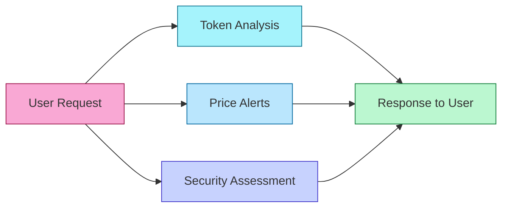
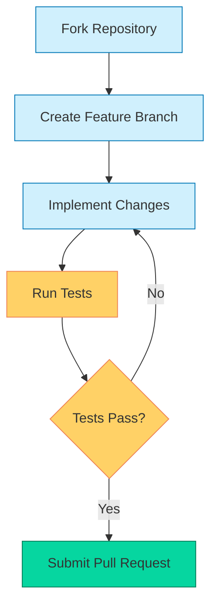

# 🤖 DEX Analysis Telegram Bot Documentation

<div align="center">
  
  
  
  
</div>

<p align="center">
  A sophisticated Telegram bot for real-time analysis and monitoring of tokens on decentralized exchanges (DEX).
</p>

## 📑 Table of Contents
- [📌 Overview](#-overview)
- [✨ Features](#-features)
- [💻 Installation](#-installation)
- [⚙️ Configuration](#️-configuration)
- [📱 Usage](#-usage)
- [🛡️ Security Considerations](#️-security-considerations)
- [📚 API Documentation](#-api-documentation)
- [🔧 Troubleshooting](#-troubleshooting)
- [🤝 Contributing](#-contributing)

## 📌 Overview

<div align="center">
  <table>
    <tr>
      <td align="center">🔄 Real-time market analysis</td>
      <td align="center">⏰ Automated price monitoring</td>
      <td align="center">🔒 Security scoring system</td>
      <td align="center">👥 User-friendly interface</td>
    </tr>
  </table>
</div>

The DEX Analysis Bot provides comprehensive token analysis, price alerts, and security assessments directly within Telegram. Monitor your favorite tokens across multiple blockchains with powerful analytics and customizable notifications.



## ✨ Features

### 📊 Token Analysis
- **💧 Liquidity Monitoring**: Real-time tracking of token liquidity pools
- **📈 Volume Analysis**: 24-hour trading volume calculations
- **👥 Holder Statistics**: Detailed breakdown of token holder distribution
- **💲 Price Tracking**: Real-time price updates and historical data

### 🔒 Security Features

<div align="center">
  <table>
    <tr>
      <th>Feature</th>
      <th>Description</th>
      <th>Impact</th>
    </tr>
    <tr>
      <td>✅ Contract Verification</td>
      <td>Checks if source code is verified on blockchain explorer</td>
      <td>🟢 High</td>
    </tr>
    <tr>
      <td>✅ Liquidity Lock Detection</td>
      <td>Verifies if liquidity is locked in a time-lock contract</td>
      <td>🟢 High</td>
    </tr>
    <tr>
      <td>✅ Ownership Status Verification</td>
      <td>Confirms if contract ownership is renounced</td>
      <td>🟢 High</td>
    </tr>
    <tr>
      <td>✅ Suspicious Function Scanner</td>
      <td>Detects potentially malicious contract functions</td>
      <td>🟢 High</td>
    </tr>
  </table>
</div>

### 🖥️ User Interface
- **🔘 Interactive menu system** for intuitive navigation
- **🔔 Customizable alerts** with multiple trigger conditions
- **📰 Detailed analytics reports** with visual representations
- **⛓️ Multi-chain support** for Ethereum, BSC, and Polygon

## 💻 Installation

### Prerequisites

<div align="center">
  <table>
    <tr>
      <td align="center"></td>
      <td align="center"></td>
      <td align="center"></td>
      <td align="center"></td>
    </tr>
  </table>
</div>

### Step-by-Step Installation

<details>
<summary>📋 Click to expand installation steps</summary>

1. **Clone the repository:**
   ```bash
   git clone https://github.com/yourusername/dex-analysis-bot
   cd dex-analysis-bot
   ```

2. **Install required dependencies:**
   ```bash
   pip install -r requirements.txt
   ```

3. **Install additional packages:**
   ```bash
   pip install python-telegram-bot web3 aiohttp
   ```
</details>

## ⚙️ Configuration

### Environment Variables

<blockquote>
<p>💡 <strong>Security Tip:</strong> Never commit your .env file to version control. Always add it to your .gitignore file.</p>
</blockquote>

Create a `.env` file in the root directory:

```env
TELEGRAM_BOT_TOKEN=your_telegram_token
WEB3_PROVIDER_URL=your_web3_provider_url
DEX_CONTRACT_ADDRESS=your_dex_contract_address
```

### Bot Configuration

```python
{
    "bot_name": "DEX Analysis Bot",
    "polling_interval": 60,
    "max_alerts_per_user": 10,
    "supported_chains": [
        "ethereum",
        "bsc",
        "polygon"
    ]
}
```

## 📱 Usage

### Basic Commands

<div align="center">
  <table>
    <tr>
      <th>Command</th>
      <th>Description</th>
      <th>Example</th>
    </tr>
    <tr>
      <td><code>/start</code></td>
      <td>Initialize the bot</td>
      <td><code>/start</code></td>
    </tr>
    <tr>
      <td><code>/analyze</code></td>
      <td>Analyze token</td>
      <td><code>/analyze 0x123...</code></td>
    </tr>
    <tr>
      <td><code>/alert</code></td>
      <td>Set price alert</td>
      <td><code>/alert 0x123... 1.5</code></td>
    </tr>
    <tr>
      <td><code>/help</code></td>
      <td>Show help menu</td>
      <td><code>/help</code></td>
    </tr>
  </table>
</div>

### Token Analysis Example

<div align="center">
  <table>
    <tr>
      <th>User Input</th>
      <th>Bot Response</th>
    </tr>
    <tr>
      <td><code>/analyze 0x742d35Cc6634C0532925a3b844Bc454e4438f44e</code></td>
      <td>
        <pre>
📊 Token Analysis
Liquidity: 1250.45 ETH
24h Volume: 45,230 USD
Holders: 1,523
Security Score: 85/100
        </pre>
      </td>
    </tr>
  </table>
</div>

## 🛡️ Security Considerations

### Best Practices

<div align="center">
  <table>
    <tr>
      <th>Category</th>
      <th>Practices</th>
    </tr>
    <tr>
      <td>🔐 <strong>API Security</strong></td>
      <td>
        • Use secure API endpoints<br>
        • Implement rate limiting<br>
        • Validate all input data
      </td>
    </tr>
    <tr>
      <td>🔒 <strong>Data Protection</strong></td>
      <td>
        • Encrypt sensitive data<br>
        • Regular security audits<br>
        • Secure storage practices
      </td>
    </tr>
    <tr>
      <td>👤 <strong>User Authentication</strong></td>
      <td>
        • Two-factor authentication support<br>
        • Session management<br>
        • Access control implementation
      </td>
    </tr>
  </table>
</div>

## 📚 API Documentation

### Endpoints

#### Token Analysis

```javascript
GET /api/v1/analyze/{token_address}
```

<details>
<summary>📋 Example Response</summary>

```json
{
    "success": true,
    "data": {
        "liquidity": "1250.45",
        "volume_24h": "45230",
        "holders": 1523,
        "security_score": 85
    }
}
```
</details>

## 🔧 Troubleshooting

### Common Issues

<div align="center">
  <table>
    <tr>
      <th>Issue</th>
      <th>Solution</th>
    </tr>
    <tr>
      <td>
        <pre>Error: Unable to connect to Web3 provider</pre>
      </td>
      <td>Check your provider URL and internet connection</td>
    </tr>
    <tr>
      <td>
        <pre>Error: Invalid Telegram token</pre>
      </td>
      <td>Verify your bot token in .env file</td>
    </tr>
  </table>
</div>

### Debug Mode

Enable debug mode for detailed logs:

```python
logging.basicConfig(level=logging.DEBUG)
```

## 🤝 Contributing

### Development Workflow



### Development Setup
1. Fork the repository
2. Create feature branch
3. Submit pull request

### Code Style
```python
# Follow PEP 8 guidelines
# Use type hints
# Include docstrings
```

### Testing
```bash
pytest tests/
coverage run -m pytest
```

---

## 📞 Support

<div align="center">
  <table>
    <tr>
      <td align="center"><a href="https://discord.gg/dexbot"></a></td>
      <td align="center"><a href="https://t.me/dexbotsupport"></a></td>
      <td align="center"></td>
    </tr>
  </table>
</div>

## 📄 License
This project is licensed under the MIT License - see the [LICENSE.md](LICENSE.md) file for details.

---

<div align="center">
  <p>⚠️ <strong>Disclaimer:</strong> This bot is for informational purposes only and is not financial advice. Always DYOR before investing.</p>
  <p>⭐ <strong>Star this repo</strong> if you find it helpful! ⭐</p>
  <p>🔄 <strong>Always update</strong> to the latest version for security patches and new features.</p>
</div>
